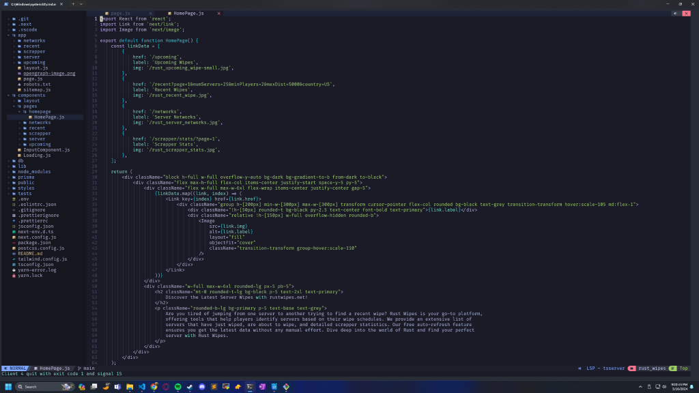

# NVChad Ubuntu Installer

A Node.js script to automate the setup of NVChad (Neovim config) on Ubuntu.

## Features

-   Installs NeoVim with the latest version
-   Sets up the JetBrains Mono Nerd Font for enhanced typography
-   Clones and configures the NVChad repository
-   Installs and configures Language Server Protocols (LSPs) for Python and TypeScript/JavaScript

## Prerequisites

Before running the setup script, ensure that your system meets the following requirements:

-   Ubuntu
-   Node.js (version 14.0.0 or higher)
-   npm (version 6.0.0 or higher)
-   Git (version 2.0.0 or higher)

## Setup Script Steps

-   Check for the required prerequisites
-   Install NeoVim
-   Set up the JetBrains Mono Nerd Font
-   Clone and configure the NVChad repository
-   Install and configure LSPs for Python and TypeScript/JavaScript

## Script Usage

1. Open Terminal in the directory you want to save the installer
2. Clone this repository to your local machine:
   `git clone https://github.com/tsmith165/nvchad-ubuntu-installer.git`

3. Navigate to the cloned directory:
   `cd nvchad-ubuntu-installer`

4. Run the setup script:
   `node setup.js`

5. Once the setup.js script is successfully completed, close all instances of Terminal
6. Open Terminal at the directory you want to edit

7. Launch NeoVim with NVChad by running:
   `nvim`

## Customization

If you want to customize the NVChad configuration, you can modify the following files:

-   `chadrc.lua`: The main configuration file for NVChad.
-   `plugins.lua`: Configuration file for plugins.
-   `lspconfig.lua`: Configuration file for Language Server Protocols.

## Troubleshooting

If you encounter any issues during the setup process, please check the `debug.log` file for detailed logs and error messages.

## License

This project is licensed under the [MIT License](LICENSE).
